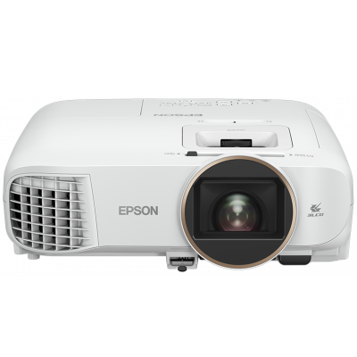

# ioBroker.epson-esc-vp21

**Tests:** 

## epson-esc-vp21 adapter for ioBroker

Adapter for [Epson projectors](https://epson.com/projectors) with ESC/VP21 support via TCP/IP (e.g. EH-TW5650)

The adapter needs the network address of the projector and the port number where it can be reached (defaults to 'Beamer:3629').
There is a poll interval in the configuration, but this normally is not necessary because the projector sends status changes by itself to open connections, so that the changes normally are updated within seconds.
There is also an entry for the type of the device. The option "Generic" should work for all Epson projectors that support ESC-VP21. But if you select your device type here, the adapter can show additional objects that are not exist for all devices.

If your projector is missing in the list, let me now.

Several data points are only returned by the projector, if it is switched on (e.g. in case of the projector Epson EH-TW5650, only state, power_state, lamp_hours and serial_number are set when the projector is turned off).

## Changelog
<!--
    Placeholder for the next version (at the beginning of the line):
    ### **WORK IN PROGRESS**
-->
### 0.1.6 (2022-11-04)
* (Azador) Cleanup of change log.
* (Azador) Cleanup of README.
* (Azador) Added further support for Epson EH-LS12000.

### 0.1.5 (2022-10-30)
* (Azador) Added release script plugins for iobroker and license
* (Azador) Removed problem with test:integration
* (Azador) Added new projector Epson EH-LS12000 and objects zoom and focus for this projector

### 0.1.1 (2022-06-09)
* (Azador) npm integration
* (Azador) Changed to Admin 5 configuration

### 0.1.0 (2022-04-12)
* (Azador) Initial Release

## License
MIT License

Copyright (c) 2022 Azador <github@lobo.uber.space>

Permission is hereby granted, free of charge, to any person obtaining a copy
of this software and associated documentation files (the "Software"), to deal
in the Software without restriction, including without limitation the rights
to use, copy, modify, merge, publish, distribute, sublicense, and/or sell
copies of the Software, and to permit persons to whom the Software is
furnished to do so, subject to the following conditions:

The above copyright notice and this permission notice shall be included in all
copies or substantial portions of the Software.

THE SOFTWARE IS PROVIDED "AS IS", WITHOUT WARRANTY OF ANY KIND, EXPRESS OR
IMPLIED, INCLUDING BUT NOT LIMITED TO THE WARRANTIES OF MERCHANTABILITY,
FITNESS FOR A PARTICULAR PURPOSE AND NONINFRINGEMENT. IN NO EVENT SHALL THE
AUTHORS OR COPYRIGHT HOLDERS BE LIABLE FOR ANY CLAIM, DAMAGES OR OTHER
LIABILITY, WHETHER IN AN ACTION OF CONTRACT, TORT OR OTHERWISE, ARISING FROM,
OUT OF OR IN CONNECTION WITH THE SOFTWARE OR THE USE OR OTHER DEALINGS IN THE
SOFTWARE.
